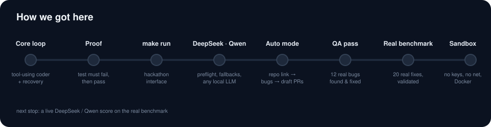

<div align="center">


# LCC

### An AI that fixes bugs has to prove the fix. That's the whole idea.

[](https://github.com/SayAn1-dls/Harness_ai/actions/workflows/ci.yml)


</div>

<br/>



## Why we built this

Ask an AI to fix a bug and it will tell you it's fixed. Sometimes it is. Sometimes it broke three other things, and you only find out later.

We don't think the model is the problem. Nobody checks its work, and that is.

## What LCC does

LCC sits around an AI model and gives it a proper place to work. You give it a bug report, or only a link to a GitHub repo. It then works like a careful developer would:

**reads the repo → finds the code that matters → fixes it → writes a test that fails without the fix → runs all the tests → tries again if something is wrong → gives the result to a person.**

One rule decides everything:

> **A fix only counts if a test fails before the change and passes after it.**
> If the test doesn't flip, it isn't a fix, however sure the model sounds.

When the fix is proven, LCC opens a *draft* pull request on your GitHub repo, with the proof inside. If you started from a GitHub issue, the PR says "Fixes #N", so merging it closes the issue. LCC never merges anything by itself: you read the PR and decide.

---

## The scoreboard



Grading ourselves on bugs we wrote ourselves felt like cheating. So we went through the git history of six open-source Python libraries: **more-itertools, toolz, boltons, tabulate, sqlparse and parse**.

- We collected **101** real bug-fix commits. **63** passed our check, which means the maintainers' own test fails on the code before their fix and passes after it. We picked **20** clear bugs from those.
- To check the harness, we gave it the maintainers' real fix. It went through every step and got **20/20**.
- To check the grading, we used a model that does nothing. It got **0/20**, so there's no passing by doing nothing.
- **There's no live score yet.** Our DeepSeek account ran out of credit (HTTP 402), and our Gemini project was blocked (HTTP 403), before we could run it. With a working DeepSeek or Qwen key it's one command, `make eval-real`. We won't put a number here until we have one.

On top of that there are **104 automated tests**. They run on every push, on Python 3.11, 3.12 and 3.13 (currently green ✅), and we've also run them in a clean Linux container.

---

## Try it

```bash
git clone https://github.com/SayAn1-dls/Harness_ai.git && cd Harness_ai
export AI_API_KEY="your DeepSeek or Qwen key"    # the only secret it needs. never saved to a file.
make setup
make doctor     # one tiny request: does the key work, is there balance, does the model exist?
make run        # paste a bug report, a GitHub issue link, or just a repo link
```

If LCC can't find a GitHub login, it asks you to sign in before it starts: through your browser (GitHub's own login page), or by pasting a token that's used only for that run and never saved. A username alone isn't enough, because GitHub only lets a signed-in account push code and open pull requests. You can also skip it, and the fixes stay on local branches.


<sub>This shows what the output looks like. It is not a recording of a real run.</sub>

---

## What happens inside


**First it reads the bug report.** "add is broken" becomes something you can test, like "`add(2, 3)` should return 5". If the report makes no sense, it asks a person instead of guessing.

**Then it learns the repo.** It goes through every file, works out which files import which, and ranks them by how closely they relate to the bug. The model starts with the right code in front of it, not the whole repo.

**Then the model fixes it** with 10 tools: search, find where something is defined, list files, read specific lines, edit, create a file, run tests, run a shell command, look at git history, and say it's done.

**Then LCC checks the fix.** Most tools stop at "the tests pass". LCC compares against the test results from *before* the change. Tests that were already failing don't count against the fix. Anything that newly fails does. And the new test has to fail on the old code, or it doesn't prove anything.

**If the fix fails, it tries again.** The next attempt gets the diff, the error and a short diagnosis. It also knows when to give up: the same failure twice, no budget left, or more tests failing with every attempt. There's no point spending tokens on a fix that isn't getting closer.

---

## Three things we haven't seen in other tools

### 1. Every fix comes with proof you can check
When LCC accepts a fix, it saves a small proof file. It holds the commit before the fix, the commit with the fix, and the tests that have to flip. Anyone can run it again:

```bash
make verify PROOF=outputs/GH-12.proof.json REPO=path/to/repo
#  ✓ on the original code the tests FAIL: the bug is real
#  ✓ with the fix the tests PASS
#  PROOF HOLDS
```

Each pull request also ends with a **"Verify it yourself"** section: four normal `git` and `pytest` commands. A maintainer can check the fix without installing LCC or trusting the AI.

### 2. It checks the test too
A test can fail before a fix and pass after it and still be weak, like `assert result != 5`. So once a fix passes, LCC **breaks the fixed lines on purpose**, one small change at a time. It turns `<` into `<=`, `and` into `or`, makes a function return `None`, or removes a `raise`. Then it checks whether the new test catches it. It leaves text inside strings and comments alone, because no test could notice a change there.

The pull request shows the result, for example *"the new test catches 4 of 6 deliberate breaks"*. With `LCC_MUTATION=gate`, a test that catches none of them gets sent back to be made stronger.

We tried it on the maintainers' own tests for our 20 real bugs. They caught **24 of 29** of our deliberate breaks. One that got through: more-itertools tests that `sliced()` rejects `-1`, but never tests `0`.

### 3. It counts how often the AI was right
In auto mode the model reports bugs, and LCC keeps track of what happens to each one:

```
The model claimed 7 bug(s).
  3 dropped before any work: 2 had no way to trigger them, 1 low confidence, 0 in files it never read.
  4 attempted: 2 proven real with a failing test, 2 could not be proven.
Proven rate: 2/4 attempted claims (2/7 of everything it claimed).
```

These numbers only show what the report looks like; your own run gives the real ones. We think any AI code tool should tell you how often its bug reports were real, so ours does.

---

## Only have a repo link? Auto mode

```bash
make auto REPO=https://github.com/someone/their-project
```

You don't need a bug report. One command does all of this:

1. **Reads the whole repo.** It runs the full test suite and a defect checker over every file. Then the AI reads every source file, most important first, up to a budget you choose (about 30k tokens by default). Big files are split into parts, not skipped. The report says how much was read, for example *"The AI read 12 of 14 source files (2,300 of 2,710 lines)."*
2. **Lists every issue it found** in `outputs/ISSUES-<repo>.md`: bugs, security problems and slow code. For each one you see where it is, what found it (the tests, the checker or the AI), and what happened to it: fixed with proof and a PR link, tried but not proven, found but not tried, or dropped with the reason.
3. **Fixes the bugs,** but only with a test that fails before the fix and passes after it. **If a bug can't be proven, it's dropped.** The AI can't invent a bug and send it to someone.
4. **Speeds up slow code, and shows the numbers.** For slow code, the model writes a small benchmark. LCC times the old and new code in alternating rounds and keeps the change only if **every test still passes** and it's **at least 1.2× faster overall, and faster in each of 3 alternating rounds**. The pull request gives the numbers, like *"12.4 ms → 3.1 ms (4.0× faster)"*. We tried it on a slow O(n²) duplicate check: the new version was more than 5× faster and was kept. A fake "speed-up" that changed nothing was rejected.

Everything that passes becomes a **draft** pull request from your fork. LCC asks before touching a repo you don't own, stops at 3 open pull requests, and runs other people's code inside Docker if Docker is running. The maintainers decide what gets merged.

---

## How we got here (mistakes included)



**Our first benchmark was wrong.** It said 4 bugs were fixed, but the model hadn't changed anything: those tests were already passing. That's where the "the test must go from failing to passing" rule came from, and it's still the most important check in the code.

**Then we went looking for bugs in our own code** and found 12. Two of them:
- One old, unrelated lint error in a repo made every correct fix fail. We lost 22 model calls to it. It takes 5 now.
- A model answered `"none"`, and our code split it into `n`, `o`, `n`, `e`: four "blocking questions". A task that could easily have been solved got sent to a person. All 12 bugs now have tests, so they can't come back.

**We made it safe to run on other people's code.**
- The target project's code never sees your API keys.
- A git guard stops it from resetting or pushing your repo, even when the command comes from inside Python.
- In Docker mode it also loses network access and can't see your files.

We tested each of these. Inside the container the key isn't there, your home folder isn't visible, and the internet can't be reached.

**We made it cheaper.** On the same 16-step session, prompts went from about 120.8k tokens to about 96.5k (**−20%**). Three changes did most of it:
- when a file is read again, the older copy drops out of the conversation;
- a passing test run is one line instead of a page of output;
- the tool descriptions got shorter.

**We added proof on top of proof.** Fixes carry a proof file and "Verify it yourself" steps. Tests get checked by breaking the fix on purpose. Auto mode counts how often the AI's bug reports were real, and speed-ups have to be measured before they're kept.

**We fitted it to the hackathon.** The final evaluation uses DeepSeek and Qwen, so LCC recognises either key without spending a token. It picks a model your account actually has, and it works with local servers that don't support tool calls.

---

## What's still missing

- **A live score from DeepSeek or Qwen.** Everything above shows the harness works. It doesn't yet show how often a real model fixes the bug.
- **A real pull request on GitHub.** Opening PRs works in our tests, against a copy of GitHub we set up locally, but it has never opened one on real GitHub.
- **A real run of auto mode.** Finding, fixing, speeding up and opening pull requests all work in our tests, against a copy of GitHub we set up locally. It hasn't run on real GitHub with a real model yet.
- **Proof that every step is worth it.** The planner, reviewer and intake steps might cost more tokens than they save. `make ablation` turns each one off and compares. It also needs a key.
- **Less help outside Python.** Python gets the most support. JavaScript, Go and Rust tests run, but get less help.
- **Token numbers are estimates.** They come from scripted runs. Live runs record what the provider actually charges.
- **20 bugs is a small benchmark.** These fixes are public, so a model may have seen some of them before.

---

<details>
<summary><b>Every command</b></summary>

| Command | What it does |
|---|---|
| `make run ISSUE=<link or text> REPO=<path or url> [BASE=<commit>] [PR=0]` | Fix one bug (or speed up code, if you ask for it) and open a draft PR; `PR=0` keeps it local |
| `make auto REPO=<url> [PR=0\|1]` | Read the repo → list issues → fix and speed up with proof → draft PRs (`PR=0` keeps everything local) |
| `make verify PROOF=outputs/<task>.proof.json REPO=<repo>` | Replay a fix's proof: the test fails on the old code and passes with the fix |
| `make eval-real` | Live score on the 20 real bugs |
| `make ablation` | Same, with planner, reviewer and intake turned off one at a time |
| `make bench-check` | Check the benchmark again: 20/20 valid, 20/20 with the real fix, 0/20 doing nothing |
| `make test` · `make lint` | 104 tests plus a small offline benchmark (no key needed) · ruff checks |
| `make doctor` · `make clean` | Health check · clean up |
</details>

<details>
<summary><b>Models and settings</b></summary>

- **DeepSeek:** `deepseek-chat`, then `deepseek-reasoner` if the first isn't available.
- **Qwen (Alibaba DashScope, international or China):** `qwen3-coder-plus`, then `qwen-plus`, then `qwen-max`.
- **Your own model:** `LCC_BASE_URL=http://localhost:8000/v1 LCC_MODEL=<name>`. It works even if the server has no tool-call support.
- A plain `sk-` key is only ever sent to DeepSeek and DashScope.
- Settings live in `lcc.config.toml`. The main ones:
  - per bug: 5 attempts, 300k tokens and 30 tool steps;
  - `audit_budget_chars` sets how much the AI reads in auto mode;
  - `min_speedup` (1.2) is the overall speed-up a change needs (it also has to win every round);
  - `LCC_MUTATION=gate` sends weak tests back;
  - `LCC_SANDBOX=docker` for full isolation;
  - `LCC_MODEL` and `LCC_PROVIDER` pick the model.
</details>

<details>
<summary><b>Rules it never breaks</b></summary>

- It only works on `agent/*` branches, and it never merges.
- Your unsaved changes are set aside before a run and put back afterwards.
- The target's code runs without your keys, and it can't reset, commit to or push your repo.
- In Docker mode the target's code has no network and only sees its own folder.
- Your key is read from `AI_API_KEY` only, and it's never written to a file.
- Benchmarks and scratch files (`.lcc/`) never end up in a fix.
</details>

<details>
<summary><b>Where things live</b></summary>

`src/lcc/`:
- `session.py`: `make run` and `make auto`, plus the issue report
- `orchestrator.py`: the steps, the checks and the retries
- `agents.py`: the prompts
- `agent_loop.py` + `tools.py`: the tools the model uses
- `proof.py`: proof files, `lcc verify` and the test checking
- `sandbox.py`: key removal, git guard, Docker
- `model.py`: DeepSeek, Qwen and local models
- `discover.py`: finding bugs in auto mode
- `bench.py`: the benchmark

Elsewhere:
- `benchmarks/real/`: the 20 real bugs
- `benchmarks/tasks/`: 7 practice bugs
- `harness/docs/DECISIONS.md`: every decision we made, and why
</details>

<br/>
<div align="center">

**We didn't make the model smarter. We made it prove what it does.**

<sub>AI Harness Hackathon 2026</sub>

</div>
