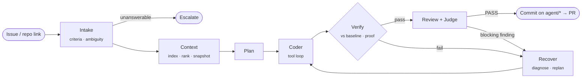
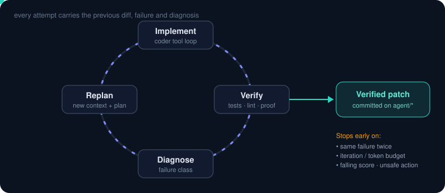

<div align="center">



# LCC: Autonomous Coding-Agent Harness

**An issue, or just a repo link, in → a test-proven fix on a branch, or a draft PR a human reviews → out.**

[](https://github.com/SayAn1-dls/Harness_ai/actions/workflows/ci.yml)


</div>

## Results so far: the honest version

| What | Result | What it proves |
|---|---|---|
| **Real benchmark:** 20 real bug fixes from 6 libraries (more-itertools, toolz, boltons, tabulate, sqlparse, parse) | Each hidden test **fails at the parent commit and passes at the real fix**: 20/20 validated (`make bench-check`) | The benchmark is real and gradeable |
| Harness on those 20 repos with the reference fix replayed (oracle, **not a model**) | **20/20** verified and graded; a do-nothing model scores **0/20** | Baseline, fail-to-pass proof, lint, review and grading work on real test suites, and the grader can't be gamed by doing nothing |
| **Live model on the real benchmark** | ⏳ **not run yet**: needs a funded DeepSeek or Qwen key (`make eval-real`) | This is the number that matters, and it is still missing |
| Unit and integration tests | 90 passing on macOS and in a clean `python:3.11-slim` Linux container; CI runs 3.11, 3.12 and 3.13 | Pipeline correctness |
| Offline toy benchmark (7 fixtures) | 7/7 with **scripted** model replies | Wiring only, not model quality |


<sub>Illustrative session (not a recording).</sub>

## Quickstart

```bash
git clone https://github.com/SayAn1-dls/Harness_ai.git && cd Harness_ai
export AI_API_KEY="<DeepSeek or Qwen key>"   # the only credential; never written to disk
make setup && make doctor                     # doctor makes ONE 8-token call to check key, balance and model
make run                                      # paste an issue URL, issue text, or just a repo link
```

| Command | What it does |
|---|---|
| `make run ISSUE=<url\|file\|text> REPO=<path\|url> [BASE=<sha>]` | Fix one issue on an `agent/*` branch. `BASE` (or `REPO=url@sha`, or a `Base commit:` line) pins the commit |
| `make auto REPO=<url> [PR=0\|1]` | No issue: find bugs → fix → prove → draft PRs (see [Auto mode](#auto-mode)) |
| `make eval-real` / `make eval` | Live score on the 20 real tasks / the 7 toy fixtures |
| `make bench-check` | Re-prove the real benchmark: validity, oracle 20/20, do-nothing 0/20 (no key) |
| `make test` | 90 tests + offline toy benchmark (no key) |

## How it works



- **Context:** the repo is indexed (Python AST; regex symbols for JS/TS/Go/Rust) and files are ranked by symbol hits, keyword overlap, import-graph PageRank and one-hop dependencies. The snapshot score is *measured*: whether the files the issue names are included, symbol and dependency coverage, requirement terms, and a related test. The gate is 75.
- **Coder:** a tool-calling loop that locates the code, reproduces the bug, fixes the root cause, adds a regression test, runs it, and calls `finish`. Tools: `search_code`, `find_symbol`, `read_file`, `repo_tree`, `edit_file`, `write_file`, `run_test`, `shell`, `git_history`.
- **Verify:** a fix counts only if **no test that passed before now fails** (baseline-aware, so pre-existing failures don't block) **and** there is proof: a baseline failure now passes, or a new test fails on the base code and passes with the change. Lint checks only the changed files, and only for errors the change introduced.
- **Recover:** the failure is classified, and the next attempt gets the diff, the failure and the diagnosis. The loop stops when the same failure repeats, the budget runs out, or failing tests rise across attempts. There are no diagnosis calls after the last attempt.



## Models: DeepSeek, Qwen, or your own

With `provider = "auto"`, a plain `sk-` key is identified with `GET /models`, which costs no tokens, and it is **only ever sent to DeepSeek and DashScope**.

- DeepSeek: default `deepseek-chat`, falling back to `deepseek-reasoner`.
- Qwen (DashScope, international or China): default `qwen3-coder-plus`, falling back to `qwen-plus`, then `qwen-max`.

A preflight call reports 401, 402, 403 or 404 in seconds, and these errors stop the run instead of failing every task. To pin a model, set `LCC_MODEL`; `LCC_BASE_URL` points the harness at any OpenAI-compatible server (vLLM, Ollama…).

The adapter handles server differences automatically:
- Parameters a server rejects (`enable_thinking`, `response_format`, `parallel_tool_calls`, `seed`) are dropped and retried.
- A server **without function calling** gets the tools described in the prompt, and `<tool_call>` blocks are parsed from the reply.
- `<think>` blocks are stripped.
- Malformed JSON is coerced safely: a string `"none"` is an empty list, not four characters.

## Auto mode

`make auto REPO=https://github.com/owner/repo` works in three steps:
1. **Find.** It runs the repo's test suite (failing tests), ruff limited to *defect* rules (undefined names, mutable default arguments, late-binding closures, injection risks; no style rules), and a model audit of the most central files. The audit must name a concrete input that triggers each bug.
2. **Prove.** Each candidate goes through the full pipeline, and a candidate that can't be proven with a failing test is dropped.
3. **Open PRs.** One PR per verified fix, **as a draft**. On a repo you can't push to, the harness asks first (or needs `PR=1`), pushes to your fork, and stops at 3 open PRs. It never merges.

## Security: what is and isn't isolated

| Mode | Target code (installs, tests, shell) | Protection |
|---|---|---|
| `sandbox = "none"` (default) | Runs on your machine | Credentials (`*KEY*`, `*TOKEN*`, cloud, SSH agent) are **stripped from its environment**. A `git` guard first on PATH blocks state-changing git in the task repo, even from `subprocess` inside Python. Destructive shell commands are blocked. **It can still read files in your home directory.** |
| `sandbox = "docker"` | Runs in a container | **No network** during tests, **no credentials**, only the workspace mounted (tested: the key is `None`, home is invisible, network is unreachable). Recommended for repos you don't trust (`LCC_SANDBOX=docker make auto …`). |

On top of that, work happens only on `agent/*` branches, your uncommitted changes are stashed and restored, folders that aren't git roots are copied instead of modified, and merge permission is never granted.

## Token efficiency (measured)

The coder's static prefix is byte-stable, so DeepSeek and DashScope prefix caching hits (`cached_share` in reports). A later read of the same lines replaces the earlier one, a passing test run is one line and a failing run shows only the failures, tool schemas are small (721 tokens per call), JSON mode avoids repair calls, and the loop stops early when retrying can't help.

| Scripted comparison (identical steps, so only prompt size differs) | Before | After |
|---|---:|---:|
| 16-step session on a large file with failing tests | 120,783 | **96,453 (−20.1%)** |
| 7 toy tasks, prompt tokens | 71,215 | **68,720 (−3.5%)**, including one extra intake retry per task, because the offline mock answers with the vague criterion "Tests pass", which the stricter intake check now rejects |
| Repo with an unrelated old lint error | 22 calls, failed | **5 calls, verified** |

These are character-based estimates from scripted runs. Real billed tokens will only be known from a live `make eval-real`.

## Limits (read before judging)

- **No live-model score yet.** Everything above measures the harness, not DeepSeek or Qwen solving issues.
- **Python is the first-class target.** JS, TS, Go and Rust get test detection, output parsing and `npm ci`, but no language-specific linting or static analysis.
- The real benchmark is small (20 tasks, all Python libraries); models may have seen some of these public fixes during training.
- The default mode is not a sandbox against a hostile repository; use `sandbox = "docker"` for that.

<details>
<summary><b>Configuration</b> (<code>lcc.config.toml</code>, all overridable by environment variables)</summary>

| Key | Default | Meaning |
|---|---|---|
| `[model] provider` / `model` / `base_url` | `auto` / `""` / `""` | `LCC_PROVIDER`, `LCC_MODEL`, `LCC_BASE_URL` |
| `[model] temperature` / `seed` | `0.0` / `7` | Reproducibility |
| `[run] max_iterations` / `token_budget` / `coder_max_steps` | `5` / `300000` / `30` | Per-issue budgets |
| `[run] test_timeout` / `preflight` / `sandbox` | `900` / `true` / `none` | `LCC_SANDBOX=docker` for isolation |
| `[auto] max_fixes` / `audit_calls` / `pr_draft` / `max_open_prs` | `3` / `2` / `true` / `3` | Auto mode |

The credential is read only from `AI_API_KEY`: never from config, docs or git.
</details>

<details>
<summary><b>Outputs and durable state</b></summary>

- `outputs/<task>.patch` and `.json`: diff, status, iterations, tokens (in/out/cached), calls, runtime.
- `agent/<task>` branch: the verified commit.
- `<repo>/harness/state/events.jsonl`: every `MODEL_CALL`, `DECISION`, `BASELINE` and `RECOVERY` event.
- `<repo>/harness/artifacts/`: intake, plans, coder transcripts, verification, `HANDOFF.md`.
</details>

<details>
<summary><b>Project map</b></summary>

`session.py` (make run / auto) · `orchestrator.py` (state machine, verify, recover) · `agents.py` · `agent_loop.py` · `tools.py` · `sandbox.py` (credential scrub, git guard, Docker) · `context_engine.py` · `discover.py` · `github_pr.py` · `model.py` (DeepSeek/Qwen adapter) · `bench.py` (real + toy benchmark, oracle, validation) · `eval.py` · `store.py`. Benchmarks: `benchmarks/real/` (20 real), `benchmarks/tasks/` (7 toy). Decisions log: `harness/docs/DECISIONS.md`.
</details>

<details>
<summary><b>Troubleshooting</b></summary>

| Message | Fix |
|---|---|
| `placeholder` / `could not identify the provider` | Export the real key, or set `LCC_PROVIDER` |
| `(401)` / `(402)` / `(403)` / `(404)` | Wrong key / top up / other project or region / set `LCC_MODEL` |
| `NOT VERIFIED (no proof)` | The change had no failing-then-passing test; see `harness/artifacts/verification_*.json` |
| `sandbox = docker, but Docker is not available` | Start Docker, or use `sandbox = "none"` |
</details>

<div align="center"><sub>AI Harness Hackathon 2026 · the model reasons, the harness makes it reliable, and the tests decide.</sub></div>
