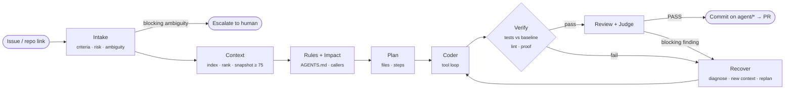
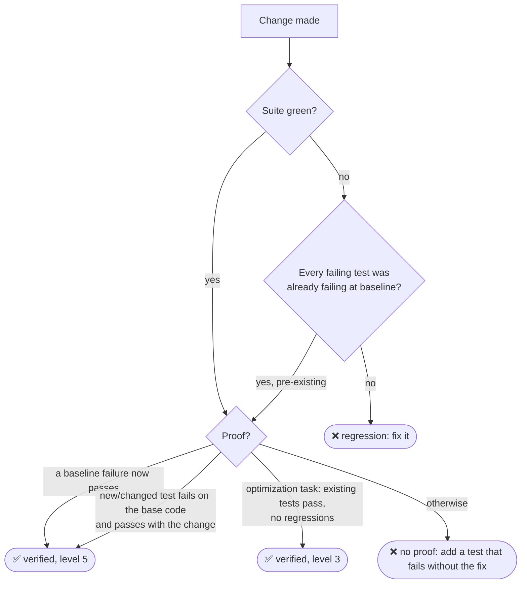
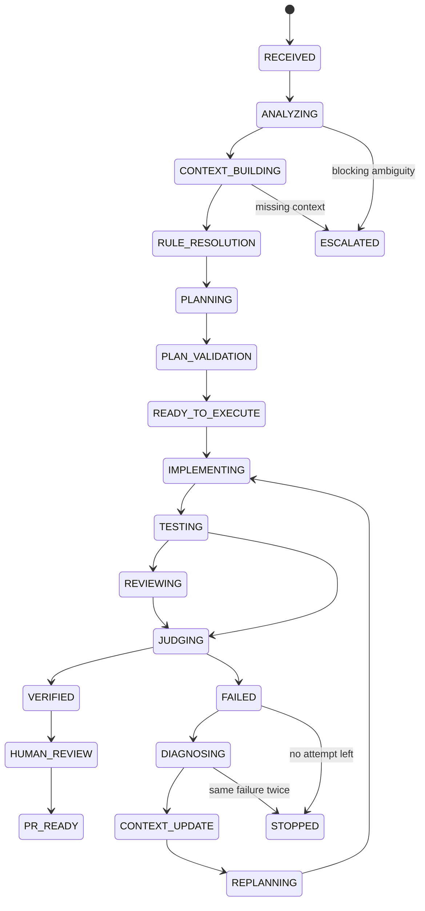
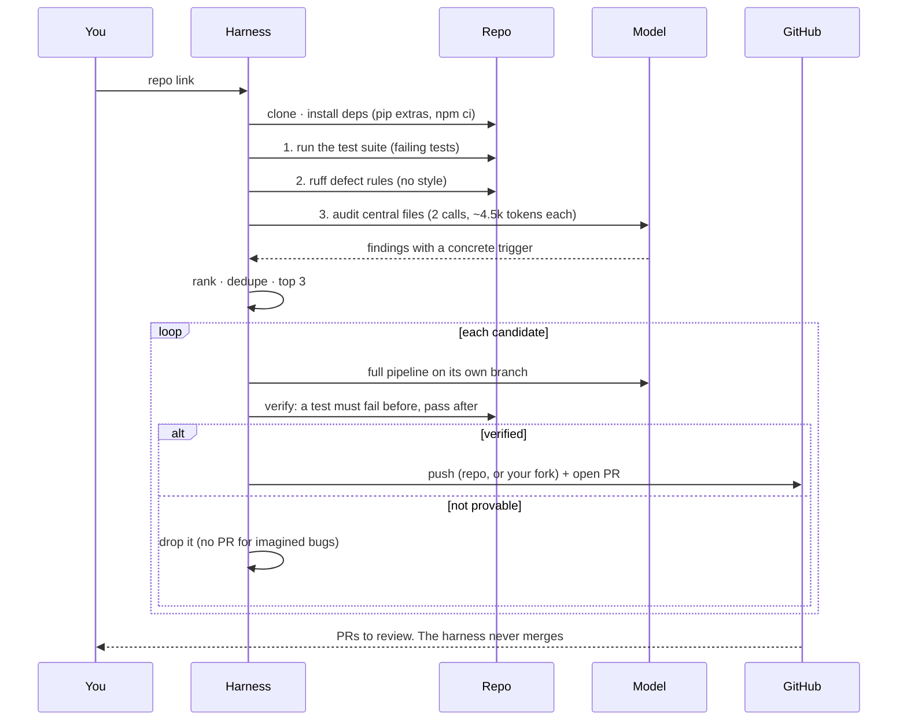

<div align="center">


# LCC: Autonomous Coding-Agent Harness

**Give it a GitHub issue, or just a repository link. It finds the code, fixes the problem, proves the fix with tests, and hands a maintainer a pull request to review.**


[Quickstart](#-quickstart) · [How it works](#-how-it-works) · [Auto mode](#-auto-mode-just-a-repo-link) · [Models](#-models-deepseek-qwen-or-your-own) · [Token efficiency](#-token-efficiency) · [Configuration](#%EF%B8%8F-configuration) · [What we built](#%EF%B8%8F-what-we-built)

</div>

---

## 🧭 What is an AI harness?

A language model on its own can *talk* about code. To actually **change** a real repository safely, it needs an environment around it. It needs the right files in front of it, tools to search, edit and run tests, rules to follow, a budget to respect, a way to notice that it is wrong, and someone to check the result before it lands.

That environment is the **harness**. The model provides reasoning; the harness makes that reasoning reliable:

| Pillar | What the harness does | Where it lives |
|---|---|---|
| **Know** (context) | Indexes the repo, ranks files by relevance and import-graph centrality, builds a bounded context snapshot | `context_engine.py` |
| **Decide** (orchestration) | Runs a state machine of specialised agents, with gates between phases | `orchestrator.py`, `state_machine.py` |
| **Act** (execution) | Gives the model a small, safe toolset: search, read, edit, shell and test | `tools.py`, `agent_loop.py` |
| **Prove** (verification) | Accepts a change only with test evidence: a test that fails before and passes after | `orchestrator._verify` |
| **Adapt** (recovery) | Diagnoses a failure, updates the context and plan, and retries with memory of what went wrong | `orchestrator._recover` |
| **Bound** (efficiency) | Meters every token, tool call and second; compacts context; stops early when retrying is pointless | `metering.py`, `agent_loop.py` |

> **LCC is not** a chatbot, an unconstrained swarm of sub-agents, or an auto-merge bot. It is a disciplined engineering loop with a human at the end.

---

## ✨ Highlights

- 🎯 **Proof, not promises.** A fix is *verified* only when a test fails on the original code and passes with the change, and no test that passed before now fails.
- 🔁 **Self-recovery.** Failed attempts are classified, and the next attempt starts from the diff, the failure and the diagnosis.
- 🔎 **Repo-only auto mode.** `make auto REPO=<url>` finds bugs on its own: failing tests, defect-only static analysis and a model audit. It fixes and verifies them, then opens one PR per fix.
- 🧠 **Built for DeepSeek and Qwen**, the models the final evaluation uses. It works with any OpenAI-compatible server, including self-hosted models without function calling.
- 🪙 **Token-frugal.** Stale reads are dropped, test output is condensed, schemas are small, prompts are cache-friendly, and the harness stops early when retrying is pointless.
- 🛡️ **Safe by construction.** It works only on `agent/*` branches. The user's uncommitted work is stashed and restored. Git-state and destructive shell commands are blocked, and merge permission is never granted.
- 📜 **Durable state.** Every decision, model call and tool result is event-sourced to `harness/state/events.jsonl`, so a run can be audited or handed off.

---

## 🚀 Quickstart

```bash
git clone https://github.com/SayAn1-dls/Harness_ai.git && cd Harness_ai
export AI_API_KEY="<your DeepSeek or Qwen key>"   # the only credential; never written to disk

make setup     # venv + dependencies (needs Python ≥ 3.11 and git)
make doctor    # checks python, git and config, then sends ONE tiny model call
make run       # interactive: paste an issue URL, issue text, or just a repo link
```


<sub>Illustrative session. The numbers and URLs show the shape of the output; they are not a recorded run.</sub>

### Every command

| Command | What it does |
|---|---|
| `make setup` | Creates `.venv`, installs the harness, runs `doctor` |
| `make run` | Interactive session. Accepts a GitHub issue URL, an issue file, pasted text (end with a line `END`), or **just a repo link** (auto mode) |
| `make run ISSUE=<url\|file\|text> REPO=<path\|url\|owner/name>` | One issue, non-interactive |
| `make run ... BASE=<sha>` | Pins the base commit (also `REPO=<url>@<sha>`, or a `Base commit: <sha>` line in the issue) |
| `make run < issue.md` | Issue piped on stdin |
| `make auto REPO=<url\|path>` | **No issue:** find → fix → verify → open PRs. `PR=0` keeps the fixes as local branches |
| `make test` | 87 unit tests, plus the offline benchmark on all 7 tasks (no key needed) |
| `make eval` | Live benchmark on the 7 tasks with your key, graded by hidden checks |
| `make doctor` | Environment + key + provider + one 8-token preflight call |
| `make clean` / `make distclean` | Removes generated artefacts / also the venv |

---

## 🔬 How it works

### The pipeline



| Stage | Agent / module | What happens |
|---|---|---|
| **Intake** | `run_intake` | Turns the issue into a problem statement, acceptance criteria, constraints and risk. Escalates only if the issue is genuinely unanswerable (no observable success condition). |
| **Context** | `context_engine` | Indexes the repo (Python AST, and regex symbols for JS/TS/Go/Rust), builds the import graph, and ranks files by symbol hits, keyword overlap, PageRank and one-hop dependencies. The snapshot must score ≥ 75; if it doesn't, a read-only context agent explores further. |
| **Rules + Impact** | `rules_engine`, `run_impact` | Discovers `AGENTS.md`, `CLAUDE.md`, `CONTRIBUTING.md` and other rules, scoped to paths. On complex (lane C) tasks, maps callers and potentially affected files. |
| **Plan** | `run_planner` | 2–6 steps naming the exact files. Simple (lane A) tasks skip this model call. |
| **Coder** | `run_coder` + `agent_loop` | A tool-calling loop: locate → reproduce → fix the root cause → add a regression test → run it → `finish`. |
| **Verify** | `_verify`, `_prove_fix` | Runs the suite and compares it with the **baseline**, lints the changed files only, and demands fail-to-pass proof. |
| **Review + Judge** | `run_reviewer`, `run_security`, `run_judge` | An adversarial model review, plus deterministic security needles (eval, shell=True, yaml.load…). Findings need quoted evidence to block. |
| **Recover** | `run_recovery` | Classifies the failure (code bug, wrong assumption, missing context, environment…) and picks the action: patch, research, replan, rollback, retry or escalate. |

### The recovery loop


Every retry sees the previous attempts in compact form: the changed files, the failure class, the failed assumption and the observations. The loop stops as soon as another attempt cannot help:

| Stop condition | Why |
|---|---|
| Same failure signature twice | A third try would repeat itself; it stops *before* paying for another diagnosis |
| `max_iterations` (5) reached | No recovery or replanning call is made after the last attempt |
| Token or runtime budget exhausted | Budgets are charged on every model call |
| Global score falling for 2 iterations | The attempts are getting worse |
| Recovery says `escalate` | A human is genuinely required |

### What "verified" means



- **Pass-to-pass:** tests that passed before must still pass. Tests that were already failing (flaky, environment-bound, unrelated) are listed but do not block.
- **Fail-to-pass:** something that was broken is now demonstrably fixed. A green suite on unchanged behaviour proves nothing.
- **Lint** checks only the files you changed, and only for errors your change introduced.
- If the full suite exceeds `test_timeout` (900 s), the tests related to the change are run instead.

<details>
<summary><b>🧰 The coder's tools</b></summary>

| Tool | Purpose | Guard rails |
|---|---|---|
| `search_code` | Literal or regex search, with a path glob | Respects `.gitignore`; capped hits |
| `find_symbol` | Where a function or class is defined | Uses the AST index |
| `read_file` | Numbered lines, max 200 per call | A later read of the same lines replaces the earlier one in context |
| `repo_tree` | File listing | Skips vendored dirs |
| `edit_file` | Replace exact text | Tolerates trailing whitespace, CRLF and pasted line numbers; points at the closest lines on a miss; `replace_all`; Python edits are syntax-checked and rejected edits leave the file untouched; keeps Latin-1 files in their encoding |
| `write_file` | New files | Scope policy; `harness/` and `.git/` are forbidden |
| `run_test` | The whole suite or one target | Failing test IDs are parsed for pytest, unittest, jest/vitest, node --test, mocha, go and cargo |
| `shell` | Reproduce with one-off commands | `python` = the target's venv; timeout 1–600 s; git-state (`commit`, `reset`, `checkout`, even `git -C . reset`) and destructive commands are blocked |
| `git_history` | `git log` / `git blame` of lines | Read-only |
| `finish` | End with a root-cause summary | Ignored if an edit in the same turn failed |

A tool error (a bad argument, an unreadable file) always comes back to the model as an `ERROR:` observation; it never crashes the task.
</details>

<details>
<summary><b>🗺️ Task state machine</b></summary>



Illegal transitions raise an error: agents cannot skip verification or jump to a PR.
</details>

---

## 🤖 Auto mode: just a repo link

```bash
make auto REPO=https://github.com/owner/repo          # find → fix → verify → one PR per fix
make auto REPO=https://github.com/owner/repo PR=0     # same, but keep the fixes as local branches
```

You can also paste just the repository link at the `issue>` prompt of `make run`.



| Source | Finds | Trust |
|---|---|---|
| Failing tests | Real, reproducible breakage | Highest |
| Static analysis | Undefined names, mutable default args, late-binding closures, `is` with literals, duplicate keys, eval/SQL/shell injection… (`discover.DEFECT_RULES`) | High; style rules are never used |
| Model audit | Logic bugs, unhandled edge cases, security holes, clear big-O waste, each with a triggering input | Only kept if the fix can be proven |

Every PR contains a **Problem** section (with the trigger), a **Fix** section (the root cause) and a **Verification** section (tests run, proof level, iterations, tokens). Pull requests use your `gh` login (`gh auth login`). The branch goes to the repo if you can push to it, otherwise to your fork.

---

## 🧠 Models: DeepSeek, Qwen, or your own

The final evaluation uses **DeepSeek and Qwen**. With `provider = "auto"` you only export the key:

| Key | Detected as | Default model → fallbacks if the account lacks it |
|---|---|---|
| plain `sk-…` accepted by DeepSeek | `deepseek` | `deepseek-chat` → `deepseek-reasoner` |
| plain `sk-…` accepted by DashScope (intl / China) | `qwen` / `qwen-cn` | `qwen3-coder-plus` → `qwen-plus` → `qwen-max` → `qwen-turbo` |
| `sk-or-` · `AIza` · `sk-ant-` · `sk-proj-` · `gsk_` · `xai-` | OpenRouter · Gemini · Anthropic · OpenAI · Groq · xAI | preset defaults |

- A plain `sk-` key is identified with `GET /models`, which costs **no tokens**, and it is sent **only to DeepSeek and DashScope**, never to other vendors.
- **Preflight:** before any work, one 8-token call. A bad key (401), no balance (402), denied access (403) or unknown model (404) is reported in seconds and stops the run, instead of failing every task.
- **Pin a model:** set `model` in `lcc.config.toml` or use `LCC_MODEL=qwen-max`. `LCC_PROVIDER` and `LCC_BASE_URL` override without editing code.

<details>
<summary><b>🏠 Running your own LLM (vLLM, Ollama, LM Studio…)</b></summary>

```bash
export LCC_BASE_URL=http://localhost:8000/v1   # any OpenAI-compatible server
export LCC_MODEL=qwen3-coder-30b               # the model name the server expects
export AI_API_KEY=anything                     # most local servers ignore it
make run
```

The adapter handles differences between servers automatically:

- A parameter the server rejects (`enable_thinking` for Qwen3, `response_format`, `parallel_tool_calls`, `seed`, a large `max_tokens`) is fixed or dropped, retried, and remembered for later calls.
- **No function calling?** The tools are described in the system prompt, and `<tool_call>{…}</tool_call>` blocks (Qwen/Hermes style) or fenced JSON calls are parsed from the reply.
- `<think>…</think>` reasoning is stripped; assistant tool-call messages send `content: ""` (some servers reject `null`).
- Malformed JSON from weaker models is coerced safely: `"none"` is an empty list, `"high"` becomes confidence 0.85, and one repair round-trip is made at most.
</details>

---

## 🪙 Token efficiency

Every step of a tool loop re-sends the whole conversation, so the harness keeps each step small and asks for fewer steps.

| Technique | Effect |
|---|---|
| Stable coder prefix (rules, repo map, ranked excerpts) | Byte-identical across steps, so DeepSeek and DashScope **prefix caching** hits; reported as `cached_share` |
| Superseded reads become stubs | Re-reading lines no longer doubles the context |
| Condensed test output | A pass is one line; a failure shows only the failures (`-rfE --tb=short`) |
| Compact tool schemas | 875 → 721 tokens per call (coder) |
| Batching instruction + `parallel_tool_calls` | Fewer round trips |
| JSON mode (`response_format`) | Avoids repair calls |
| Early stops | No diagnosis after the last attempt; a repeated failure stops before another diagnosis |
| Lane A skips the planner; issue text is capped at 8k chars | Fewer and smaller calls |

**Measured with scripted models, where every version replays identical steps, so only prompt size differs:**

| Scenario | Before | After | Change |
|---|---:|---:|---:|
| 16-step session on a large file with failing tests | 120,783 tokens | 96,453 tokens | **−20.1%** |
| All 7 benchmark tasks (latest round of trims) | 71,215 tokens | 66,743 tokens | **−6.3%** |
| Repo with an unrelated old lint error (bug fixed in the QA pass) | 22 calls · 16,473 tokens · failed | 5 calls · 2,066 tokens · verified | **−87%** |

---

## ⚙️ Configuration

Everything lives in [`lcc.config.toml`](lcc.config.toml). Environment variables override it without editing files.

<details>
<summary><b>All settings</b></summary>

| Section | Key | Default | Meaning |
|---|---|---|---|
| `[model]` | `provider` | `auto` | `auto`, `deepseek`, `qwen`, `qwen-cn`, `gemini`, `openai`, `anthropic`, `openrouter`, `groq`, `grok` or `custom` (env `LCC_PROVIDER`) |
| | `model` | `""` | Pin a model (env `LCC_MODEL`); empty = the preset default with fallbacks |
| | `base_url` | `""` | Any OpenAI-compatible endpoint (env `LCC_BASE_URL`) |
| | `temperature` / `seed` | `0.0` / `7` | Reproducibility; `seed` is sent only where it is accepted |
| | `model_fast` / `model_strong` | `""` | Optional routing: cheap model for intake/review/recovery, strong model for hard coding |
| `[run]` | `max_iterations` | `5` | Coder/recovery attempts per issue |
| | `token_budget` | `300000` | Hard cap per issue |
| | `coder_max_steps` | `30` | Tool-loop steps per attempt (warned 3 steps before the end) |
| | `test_timeout` | `900` | Seconds for a full suite run |
| | `prepare_env` | `true` | Isolated venv + declared test extras / dependency groups, `npm ci` for JS |
| | `preflight` | `true` | One tiny call before work |
| `[auto]` | `max_fixes` | `3` | Candidates fixed per repo |
| | `audit_calls` / `audit_chars` | `2` / `18000` | Model-audit budget |
| | `open_pr` / `pr_draft` | `true` / `false` | PR behaviour (env `LCC_OPEN_PR=0`) |

The credential is read **only** from `AI_API_KEY`. It is never stored in config, docs, the Makefile or git. A local `.env` (gitignored) is loaded for development.
</details>

---

## 📦 What you get after a run

| Output | Content |
|---|---|
| `outputs/<task>.patch` | The diff |
| `outputs/<task>.json` | Status, stop reason, iterations, tokens (in/out/cached), model and tool calls, runtime, the coder's summary |
| `outputs/auto-<repo>.json` | Auto mode: candidates, verified fixes, PR URLs, discovery tokens |
| `agent/<task>` branch | The verified commit. The harness never merges it, and your original branch and uncommitted changes are restored |
| `<repo>/harness/state/events.jsonl` | Every `MODEL_CALL`, `DECISION`, `BASELINE`, `RECOVERY`… (git-excluded in the target) |
| `<repo>/harness/artifacts/` | `intake.json`, `plan_v*.json`, `coder_*_transcript.json`, `verification_*.json`, `HANDOFF.md` |

---

## 🧪 Testing and benchmark

```bash
make test    # 87 unit/integration tests + offline benchmark, 7/7 resolved
make eval    # live: your model on the same 7 tasks, graded by hidden checks
```

| Task | Category | What it exercises |
|---|---|---|
| `simple_bug` | simple | Off-by-one in `mean()` |
| `pagination` | simple | 1-based pages, partial and empty pages, `ValueError` |
| `multi_file` | multi-file | EUR support across `money.py` and `invoice.py` |
| `missing_context` | missing context | The real cause hides in `utils/text.py`, not the obvious module |
| `failure_heavy` | recovery | The obvious fix breaks another test, so the second attempt must recover |
| `security_traversal` | security | Path traversal in `read_upload`; triggers the security review |
| `ambiguous` | escalation | No success condition, so the harness must escalate, not guess |

Each task has a **hidden check** the agent never sees. It fails on the original code and passes with a reference fix.

The test suite covers, among other things:
- the tool loop and its guards;
- verification against baseline failures;
- regressions still being caught;
- DeepSeek/Qwen provider behaviour against a fake server (402/403/404, model fallback, parameter adaptation, text-mode tools);
- auto mode end to end against a fake GitHub;
- a JavaScript repo end to end;
- a regression test for each bug found in the QA pass.

---

## 🛡️ Safety guarantees

- Works only on `agent/<task>` branches; `main`/`master`/`trunk` are refused as task branches.
- **Never merges.** `MERGE_PR` is denied even when granted explicitly.
- Your uncommitted changes are stashed before a run and restored after it. A folder that is not a git root is copied to `workspaces/`, never modified in place.
- Blocked shell commands: `git push/reset/checkout/commit/…` (including `git -C … reset`), `sudo`, `rm -rf /`, and piping into `sh`.
- Paths are sandboxed to the workspace; `harness/` and `.git/` can't be written.
- The key comes from the environment only, and an ambiguous key is never sent to vendors other than DeepSeek and DashScope.

---

## 🩺 Troubleshooting

| Message | Meaning | Fix |
|---|---|---|
| `AI_API_KEY is set to a placeholder` | You exported `your-key` or similar | Export the real key |
| `could not identify the provider` | Neither DeepSeek nor DashScope accepted the key | Check the key, or set `LCC_PROVIDER` / `LCC_BASE_URL` |
| `(401) key rejected` | Wrong or revoked key | New key |
| `(402) insufficient balance` | No credit | Top up the account |
| `(403) not allowed` | The project or region is denied access | Different project or region (`qwen-cn`) |
| `(404) model not found` | The model is not served to this account | Set `LCC_MODEL` to one the account has |
| `NOT VERIFIED (no proof)` | The change had no test that fails without it | The harness retries automatically; see `harness/artifacts/verification_*.json` |
| PR not opened | `gh` missing, or not signed in | `gh auth login`; the verified branch is still there |

---

## 🗂️ Project structure

<details>
<summary><b>Source map</b></summary>

```
src/lcc/
├── cli.py            # `lcc` commands: start, bench, doctor, ingest/run/status, approve/pr
├── session.py        # make run / make auto: issue parsing, repo prep, solve(), auto_fix(), reports
├── orchestrator.py   # state machine driver: intake → context → plan → code → verify → review → recover
├── agents.py         # intake, context, planner, coder, reviewer, security, judge, recovery
├── agent_loop.py     # tool-calling loop: stale-read stubs, compaction, repeat guard, step warnings
├── tools.py          # search/read/edit/shell/test tools, test-output parsers, sandbox policy
├── context_engine.py # repo index, symbols, import graph, PageRank, retrieval + snapshot score
├── discover.py       # auto mode: failing tests, ruff defect rules, model audit, ranking
├── github_pr.py      # push to repo or fork, open PR, never merge
├── model.py          # DeepSeek/Qwen/OpenAI-compatible adapter, preflight, fallbacks, text-mode tools
├── metering.py       # per-call token/runtime charging + MODEL_CALL events
├── routing.py        # optional fast/strong model routing
├── rules_engine.py   # AGENTS.md / CLAUDE.md / CONTRIBUTING rules, scoped to paths
├── lanes.py          # complexity → lane A/B/C
├── eval.py           # global task score from recorded evidence
├── bench.py          # benchmark runner with hidden checks
├── store.py          # event-sourced state + artifacts + handoff
├── schemas.py        # pydantic models: TaskState, Budget, Finding, …
├── state_machine.py  # legal transitions
└── workspace.py      # git: task branches, commits, rollback
benchmarks/tasks/     # 7 tasks: repo/, issue.md, hidden check/, scripted.json
harness/docs/         # architecture, decisions log, handoff
tests/                # 87 tests
```
</details>

---

## 🏗️ What we built

<details open>
<summary><b>Timeline</b></summary>

1. **Core loop.** Native tool calling, the ACI tool loop, real gates, the iteration contract, event-sourced state.
2. **Benchmark + proof.** 7 tasks with hidden checks; fail-to-pass verification, so "tests pass" without a behaviour change is not a pass.
3. **Hackathon interface.** `make setup / run / test / clean`, `AI_API_KEY` only, and `lcc.config.toml` as the single model definition.
4. **QA hardening.** Uncommitted user work is protected, re-runs get fresh branches, repos without commits work, and empty input exits with code 2.
5. **DeepSeek and Qwen readiness.** DashScope presets, a probe limited to those two vendors, preflight, model fallback, fatal account errors, parameter adaptation, and tools for servers without function calling.
6. **Baseline-aware verification.** Pre-existing failures no longer block, a timed-out suite falls back to targeted tests, the base commit can be pinned, and npm/Go/Cargo projects are supported.
7. **Auto mode.** A repo link alone → discover → verified fixes → one PR each, never merged.
8. **QA pass.** 12 reproduced bugs fixed, each with a regression test (15 of the 19 new tests fail on the pre-fix code).
9. **Efficiency round.** Leaner schemas and prompts (−6.3% on the benchmark, −20.1% on long sessions against the start).
</details>

### Honest status

- ✅ 87 tests pass. The offline benchmark resolves 7/7, but its model replies are **scripted**: it proves the pipeline, not the model.
- ⏳ **Live accuracy on DeepSeek or Qwen has not been measured yet.** It needs a funded key: `make doctor && make eval`.
- ⏳ `make setup && make test` in a clean Linux container is not yet run (so far tested on macOS, Python 3.13).

---

<div align="center">
<sub>Built for the AI Harness Hackathon 2026 · the model reasons, the harness makes it reliable.</sub>
</div>
